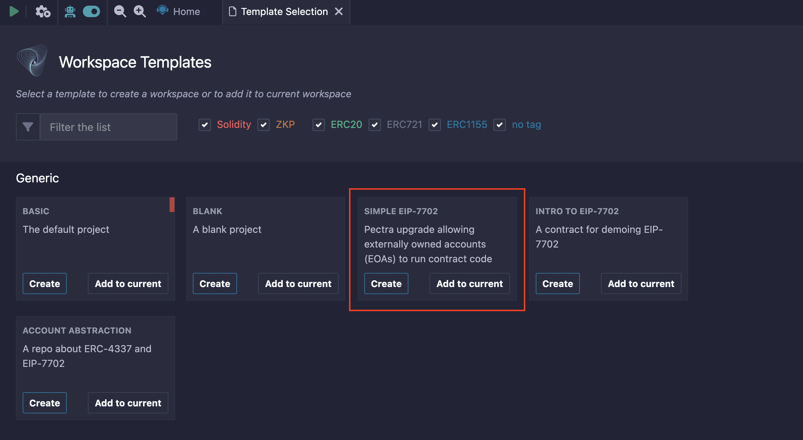
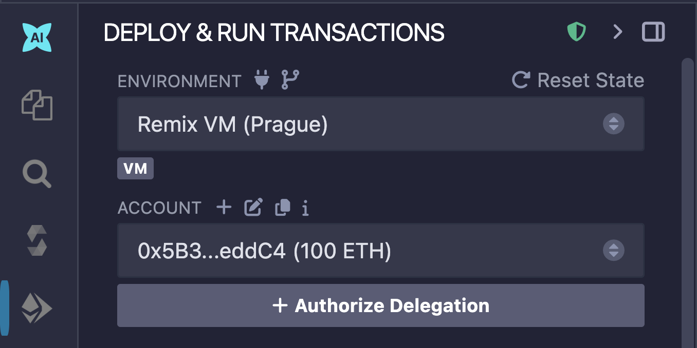
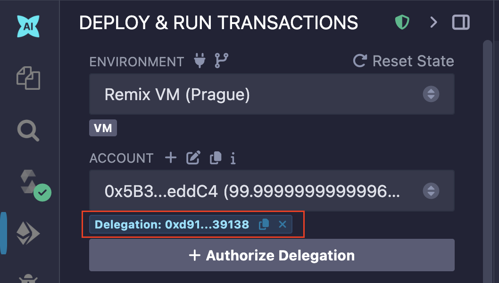
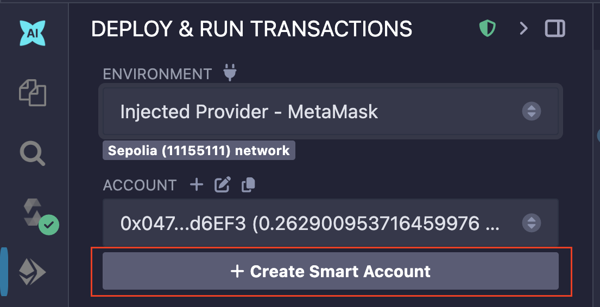
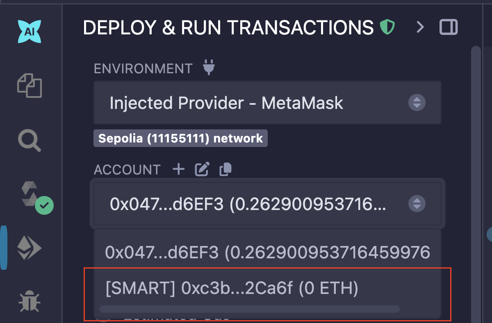
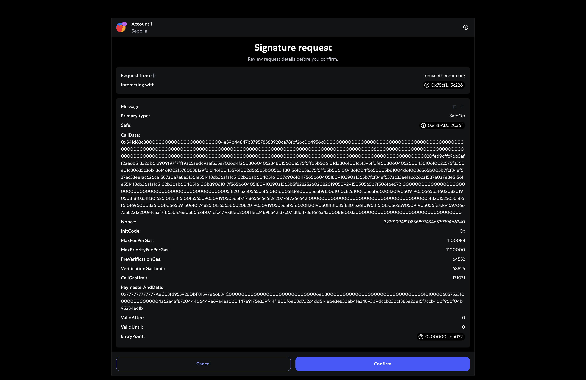
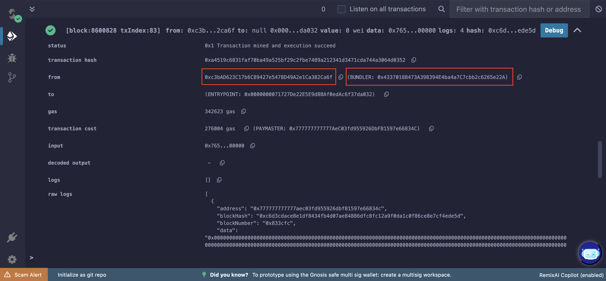

# Account Abstraction & Smart Accounts

Remix has functionality for working with EIP 4337 and EIP 7702.

In the Ethereum blockchain, there are two different types of accounts:

- Externally Owned Accounts (EOA): which require a private key and can initiate transactions.
- Smart Contract Accounts (SCA): which represents code deployed on the blockchain.

Until the Pectra upgrade, externally owned accounts (EOAs) could not have code associated with them. Pectra went live on 7 May 2025 and introduced EIP-7702, which lets an EOA attach contract code for a transaction. When an EOA is linked to code (a “Connected EOA”), it can behave like a smart account and gain features such as **transaction batching**, **gas sponsorship**, and **delegated actions**.

For more information, see this [overview of EIP-7702](https://eip7702.io).

## Using EIP 7702 in Remix

### EIP-7702 Template

The EIP-7702 template is located in the Template Explorer. To get to the Template Explorer, click the "hamburger menu" in the File Explorer, and select "Create Using Template".



The Simple EIP-7702 template includes a README file that may be helpful to review as an introduction to this EIP's features.

The Account Abstraction template has many examples and resources for both EIP-4337 and EIP-7702, including a very informative README file.

### Connecting an EOA account to a Smart Contract

The 7702 GUI only appears in Remix when deploying to the Prague flavor of the Remix VM.



The **Authorize Delegation** button will open a modal where you’ll input the contract’s address.

But before clicking that button, first you need the contract’s address — so deploy the compiled contract and copy its address.

Then click the **Authorize** button and a modal will appear:


And here, you’ll input the contract’s address. Then, when you hit Authorize, you are creating a pointer from the EOA to the Smart Contract Address.

Then below the Account at the top of Deploy & Run, you’ll see a badge that contains the contract’s address.



And in the **Deployed contracts** section, you’ll see this:


And when you open up the account (which is the new deployment), you can see that it can execute code.

## Account Abstraction with EIP 4337 in Remix

### Gnosis Safe Smart Accounts in Remix

There is a graphic user interface (GUI) for creating Gnosis Safe Smart Accounts. This allows gasless transactions among other features.

This functionality is only available when connected to the **Sepolia test network**.
And when connected to Sepolia, a new button will be displayed: **Create Smart Account**.



Click on the Create Smart Account button and you’ll get a modal with information about Safe Smart Accounts, which will also show the address of the EOA that will be the Owner of the Smart Contract Account.

After clicking “continue” in the modal, the Smart Contract Account will soon be created.

```{note}
**Be Patient** It can take about 15 seconds to be created.

```

When the new account is done “cooking”, a toaster will then pop up at the bottom of Remix with the new Smart Contract Account’s address.

After the toaster goes away, there won’t appear to be any visible change in Remix.

#### Finding the newly created Safe Smart Account

Go to the **Accounts** section of **Deploy & Run** and you will see the Smart Accounts. Select the address that begins with "[SMART]". The Owner of the account will then appear in a “badge” below it:



#### Notice that there is no ETH in the account.

Will we need to fund this account before it can be used? No!

#### Making a gasless transaction

Compile a contract. And deploy using the newly created [SMART] account.

Your wallet will issue you a signature request.



In the image above from a wallet, the Safe address and an address for “Interacting with” can be seen.

When the transaction goes through, go to Remix’s terminal and click the new transaction.



You will see both the Smart Contract Account and its associated bundler.

Note: Following [EIP-155](https://eips.ethereum.org/EIPS/eip-155), Safe Smart Account contracts use a deterministic deployment proxy so for a contract deployed using a smart account, the msg.sender will be: 0x4e59b44847b379578588920cA78FbF26c0B4956C.
