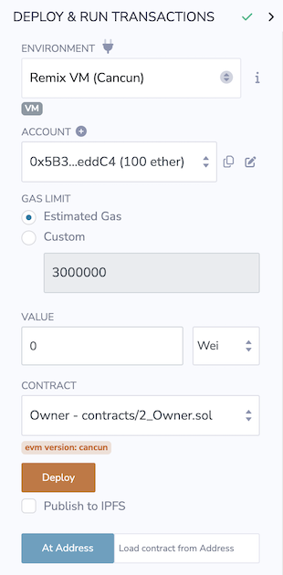
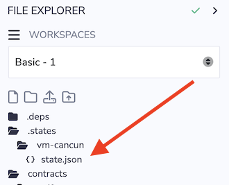
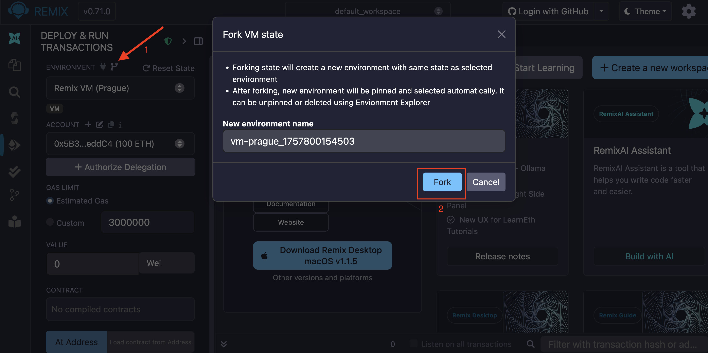
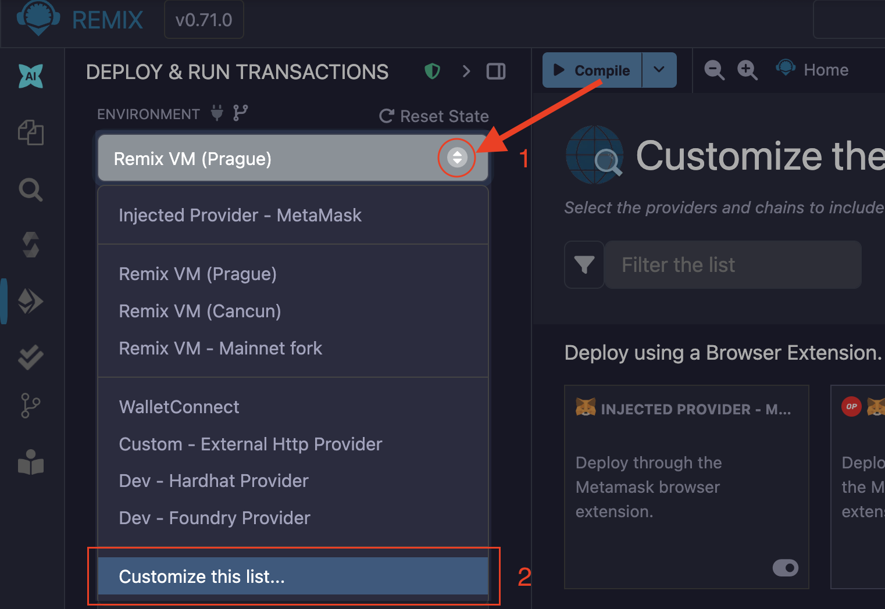
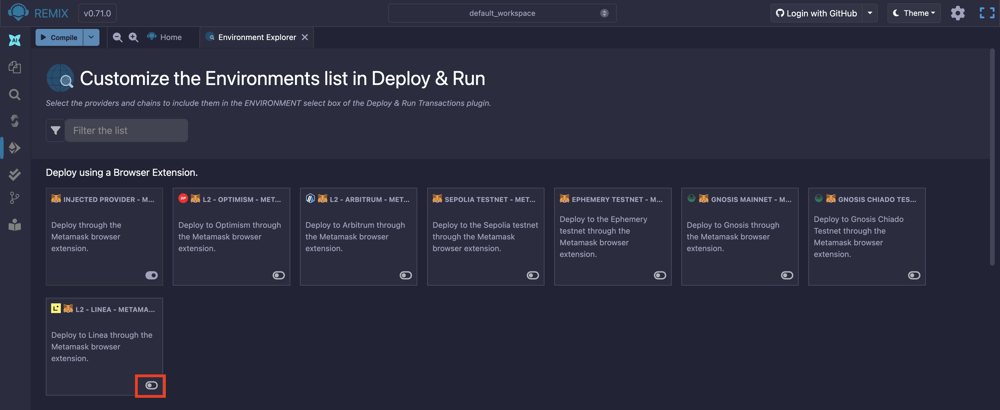
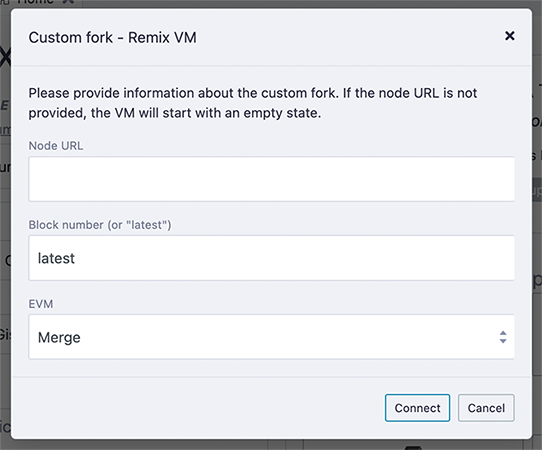
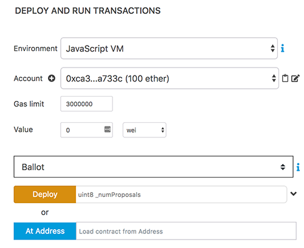

# Deploy & Run

The Deploy & Run module is for sending transactions to the current **Environment**.

The three main actions of the Deploy & Run module are:

1. **Deploying** a contract
2. **Accessing** an onchain contract
3. **Interacting** with the functions of a deployed contract

This documentation page will cover **Deploying** and **Accessing**. Interacting will be covered in {doc}`Deploy & Run part 2 </udapp>`.



To deploy a contract, you need to have a contract compiled. To check that there is a compiled contract, look in the **CONTRACT** selectbox under the VALUE input field.

If nothing is there, you'll need to compile a contract. If you do not see your desired contract in the CONTRACT selectbox list, make sure the file with the contract is the active tab in the Editor.

Once the contract is selected, choose the chain for deployment and/or method for deployment in the **ENVIRONMENT** selectbox.

```{note}
If you want to connect Remix with a browser wallet (e.g., MetaMask,
Phantom), use **Injected Provider**. Select your desired chain in the wallet.

```

For assistance with getting the correct configuration (the RPC server address, etc.), click the plug icon next the word **ENVIRONMENT** to go to [chainlist.org](chainlist.org).


## Remix VM

The Remix VM is a sandbox blockchain in the browser. Transactions do not require an approval to run. Remix VM comes with 10 accounts, each loaded with 100 ETH.

In the current version of Remix, the **state** of the Remix VM chain is saved in the **.states folder** in the File Explorer. This was not the case in earlier versions of Remix where this chain would reset when the browser was refreshed.

To prevent saving of the Remix VM chain state, uncheck the **Save environment state** in the Settings panel.

Saving the state means you can refresh the browser and not lose your work, the caveat being that browser storage is inherently unstable. Of course if you push to a remote repo, or if you use Remixd to share a folder on your hard drive, then you are not relying on the browser to save your work.

In collaborative workflows, sharing the state of the Remix VM is a great way to work out bugs. Just have your teammates load the **state.json** file into their instance of Remix.



## Environment

- `Injected Provider - provider name`: Connects Remix to an Injected Web3 Provider. The most common injected provider is `Metamask`.

- `Remix VM (Cancun)` : Cancun is the current fork of Ethereum

- `Remix VM - Mainnet fork` : This will fork the Ethereum Mainnet and load it into the Remix VM. This is useful for developing contracts that need to access deployed mainnet contracts. (See below for more info about forking.)

- `Remix VM - Sepolia fork` : Same as above except this forks the Sepolia testnet. (See below for more info about forking.)

- `Remix VM - Custom fork` : Forks a chain at the block number and in an EVM version of your choice. (See below for more info about forking.)

- `Testnet - Sepolia` Connects Remix to an Injected Provider (using a browser wallet) with the settings for the Sepolia test network.

- `WalletConnect`: Connects Remix to a wallet on a mobile device.

- `L2 - Optimism Provider`: Connects Remix to an Injected Provider (using a browser wallet) with the settings for the Optimism mainnet.

- `L2 - Arbitrum One Provider`: Connects Remix to an Injected Provider (using a browser wallet) with the settings for the Arbitrum One network.
- `L2 - Linea Provider`: Connects Remix to an Injected Provider (using a browser wallet) with the settings for the Linea mainnet.
- `L2 - Gnosis Provider`: Connects Remix to an Injected Provider (using a browser wallet) with the settings for the Gnosis chain.

- `Ephemery Testnet`: Connects Remix to an Injected Provider (using a browser wallet) with the settings for the Ephemery network. [Ephemery](https://github.com/ephemery-testnet/ephemery-resources) is a test chain that regularly refreshes. As such, it is much easier to get test ETH from its faucets.

- `Custom - External HTTP Provider`: Connects Remix to a remote node. The URL of the selected provider — Geth, Parity or any Ethereum client — needs to be input. (See below for more info about External HTTP Provider.)

- `Dev - Hardhat Provider`: Connects Remix to a local Hardhat test chain.

- `Dev - Ganache Provider`: Connects Remix to a local Truffle Ganache test chain.

- `Dev - Foundry Provider`: Connects Remix to a local Foundry Anvil test chain.

- `Remix VM (Shanghai)` : The Remix VM with the functionality of the **Shanghai** fork.

- `Remix VM (Paris)` : The Remix VM with the functionality of the **Paris** fork.

- `Remix VM (London)` : The Remix VM with the functionality of the **London** fork.

- `Remix VM (Berlin)` : The Remix VM with the functionality of the **Berlin** fork.

## Forking chains in Remix

Forking a chain will bring that chain to the Remix VM. Once it is forked, you'll have access to the 10 accounts loaded with 100 ETH.

You can also fork the Remix VM in its current state. Click the version control icon to the right of the Environment title to create a fork and then to name it. Switching between forks is done in the Environment dropdown menu. You can also reset the state of the VM by clicking the refresh icon to the right of the version control icon. Forking the VM lets you snapshot a working state, try changes, and return to the original if needed.



If **Save environment state** (Settings → General) is enabled, the Remix VM
state (including forked VM states) is saved in the `.states` folder so you can
refresh and resume later. Browser storage can still be cleared or corrupted, so
back up important work with Remixd or Git.

### Curate & delete Environments

At the bottom of the **Environment** dropdown, click **Customize this list** to
open the Environment Explorer.



From there you can, show/hide networks that appear in the dropdown (e.g., Linea) but clicking the toggle attached to the cards.



You can also delete old **in-browser forked states** you no longer need (look under
“Deploy to an In-browser Forked State” and click **Delete Environment**).


### Custom Fork

The Custom fork option allows you to specify a chain's RPC server, a block number, and an EVM version.



You can get the **Node URL** from chainlist.org. If the chain does not load, you may need to choose a different RPC server. You will also need to choose an EVM version appropriate to the block number. So, if you choose a very low block number, the EVM with the Merge “flavor” won’t work because this version of the EVM came out after your chosen block.

## More about External HTTP Provider

If you are using Geth and https://remix.ethereum.org, please use the following Geth command to allow requests from Remix:

```shell
geth --http --http.corsdomain https://remix.ethereum.org
```

Also see [Geth Docs about the http server](https://geth.ethereum.org/docs/interacting-with-geth/rpc)

To run Remix using https://remix.ethereum.org and a local test node, use this Geth command:

```shell
geth --http --http.corsdomain="https://remix.ethereum.org" --http.api web3,eth,debug,personal,net --vmdebug --datadir <path/to/local/folder/for/test/chain> --dev console
```

If you are using Remix-alpha or a local version of Remix, replace the url of the --http.corsdomain with the url of Remix that you are using.

To run Remix Desktop and a local test node, use this Geth command:

```shell
geth --http --http.corsdomain="package://a7df6d3c223593f3550b35e90d7b0b1f.mod" --http.api web3,eth,debug,personal,net --vmdebug --datadir <path/to/local/folder/for/test/chain> --dev console
```

Also see [Geth Docs on Dev mode](https://geth.ethereum.org/docs/developers/dapp-developer/dev-mode)

The Web3 Provider Endpoint for a local node is **http://localhost:8545**

---

**WARNING:** Don't get lazy. It is a bad idea to use the Geth flag <b>--http.corsdomain</b> with a wildcard: `--http.corsdomain *`

If you put the wildcard `*`, it means everyone can request the node. Whereas, if you put a URL, it restricts the urls to just that one instance - e.g. `--http.corsdomain 'https://remix-alpha.ethereum.org'`

Only use `--http.corsdomain *` when using a **test chain** AND using only **test accounts**. For real accounts or on the mainchain, **specify the url**.

---

## Account:

- Account: the list of accounts associated with the current
  environment (and their associated balances). On the Remix VM, you have a choice of five accounts. If using Injected Provider with MetaMask, you need to switch the account in MetaMask.

## Gas Limit:

- This sets the maximum amount of gas allowed to be spent for all the contract
  transactions created in Remix.

## Value:

- This sets the amount of ETH, WEI, GWEI, etc. that is sent to a contract or a payable function. <br>
  **Note:** payable functions have a red button.

The **Value** field is always reset to 0 after each transaction execution. <br>
The **Value** field is **NOT** for gas.



## Deploy and AtAddress

- In the image above, the select box is set to **Ballot**. This select box will contain the list of compiled contracts.

- `Deploy` sends a transaction that deploys the selected contract. When
  the transaction is mined, the newly created instance will be added
  (this might take several seconds). <br>**Note:** If the contract's constructor function has parameters, you will need to specify them.

- `AtAddress` is used to access a contract that has already been deployed. Because the contract is already deployed, accessing a contract with **AtAddress** does not cost gas.

**Note:** When using AtAddress, be sure you trust the contract at that address.

To use **AtAddress**, you need to have the **source code** or **ABI** of the deployed contract **in the active tab** of the Editor. When using the source code, it must be compiled with the same compilation settings as the deployed contract that you are trying to access.

## Using the ABI with AtAddress

The **ABI** is a JSON array which describes the contract's interface.

To interact with a contract using the ABI, create a new file in Remix
with extension **\*.abi** and copy the ABI content into it.

Make sure this file is the active tab in the Editor. Then, in the field next to `At Address`, input the contract's address and click on `At Address`. If successful, an instance of the contract will appear below in the list of **Deployed Contracts**.

**Note:** To generate the ABI, in the Solidity compiler after a contract is compiled, click on the **Compilation Details** button. A modal will come up that contains the ABI, among other info.

## Pending Instances

Validating a transaction may take several seconds. During this time, the GUI
shows it in a pending mode. When the transaction is mined, the number of
pending transactions updates, and the transaction is added to the log
({doc}`see terminal </terminal>`).

## Using the Recorder

The Recorder is a tool used to save a bunch of transactions in a JSON file and
re-run them later, either in the same environment or in another.

Saving to the JSON file (by default it's called scenario.json) allows one to easily check the transaction list, tweak input parameters, change linked libraries, etc.

There are many use cases for the Recorder.

For instance:

- After having coded and tested contracts in a constrained
  environment, like the Remix VM, you could then switch the environment and redeploy the contract to a more realistic environment, like a public testnet or to a Geth node. By using the generated **scenario.json** file, you will be using all the same settings that you used in the Remix VM. And, this means that you won't need to click the interface 100 times or whatever to get the state that you achieved originally. Thus the Recorder can be a tool to protect your sanity.

  You can also change the settings in the scenario.json file to customize the playback.

- Deploying a contract often requires more than creating one
  transaction, and the Recorder will automate this deployment.

- Working in a dev environment often requires setting up the
  state initially.


When checked, the option `Run transactions using the last compilation result` allows you to develop a contract and easily set the state using **the latest compiled versions of the contracts.**

### scenario.json

To create this file in the Recorder, you first need to have run some transactions. In the image above, it shows a `0` next to **Transactions Recorded**. So, this isn't the right moment to save transactions because, well, because there aren't any. But, each time you make a transaction, that number will increment. So, when you are ready with some transactions, click the floppy disk icon and the scenario.json file will be created.

The JSON file below is an example of the scenario.json file.

In it, three transactions are executed:

The first corresponds to the deployment of the lib `testLib`.

The second corresponds to the deployment of the contract `test` with the
first parameter of the constructor set to 11. That contract depends
on a library. The linkage is done using the property `linkReferences`.
In that case we use the address of the previously created library :
`created{1512830014773}`. The number is the id (timestamp) of the
transaction that led to the creation of the library.

The third record corresponds to the call to the function `set` of the
contract `test` (the property to is set to: `created{1512830015080}`) .
Input parameters are `1` and
`0xca35b7d915458ef540ade6068dfe2f44e8fa733c`

All these transactions are created using the value of the accounts
`account{0}`.

```
{
"accounts": {
    "account{0}": "0xca35b7d915458ef540ade6068dfe2f44e8fa733c"
},
"linkReferences": {
    "testLib": "created{1512830014773}"
},
"transactions": [
    {
    "timestamp": 1512830014773,
    "record": {
        "value": "0",
        "parameters": [],
        "abi": "0xbc36789e7a1e281436464229828f817d6612f7b477d66591ff96a9e064bcc98a",
        "contractName": "testLib",
        "bytecode": "60606040523415600e57600080fd5b60968061001c6000396000f300606060405260043610603f576000357c0100000000000000000000000000000000000000000000000000000000900463ffffffff1680636d4ce63c146044575b600080fd5b604a6060565b6040518082815260200191505060405180910390f35b6000610d809050905600a165627a7a7230582022d123b15248b8176151f8d45c2dc132063bcc9bb8d5cd652aea7efae362c8050029",
        "linkReferences": {},
        "type": "constructor",
        "from": "account{0}"
    }
    },
    {
    "timestamp": 1512830015080,
    "record": {
        "value": "100",
        "parameters": [
        11
        ],
        "abi": "0xc41589e7559804ea4a2080dad19d876a024ccb05117835447d72ce08c1d020ec",
        "contractName": "test",
        "bytecode": "60606040526040516020806102b183398101604052808051906020019091905050806000819055505061027a806100376000396000f300606060405260043610610062576000357c0100000000000000000000000000000000000000000000000000000000900463ffffffff1680632f30c6f61461006757806338cc48311461009e57806362738998146100f357806387cc10e11461011c575b600080fd5b61009c600480803590602001909190803573ffffffffffffffffffffffffffffffffffffffff16906020019091905050610145565b005b34156100a957600080fd5b6100b1610191565b604051808273ffffffffffffffffffffffffffffffffffffffff1673ffffffffffffffffffffffffffffffffffffffff16815260200191505060405180910390f35b34156100fe57600080fd5b6101066101bb565b6040518082815260200191505060405180910390f35b341561012757600080fd5b61012f6101c4565b6040518082815260200191505060405180910390f35b8160008190555080600160006101000a81548173ffffffffffffffffffffffffffffffffffffffff021916908373ffffffffffffffffffffffffffffffffffffffff1602179055505050565b6000600160009054906101000a900473ffffffffffffffffffffffffffffffffffffffff16905090565b60008054905090565b600073__browser/ballot.sol:testLib____________636d4ce63c6000604051602001526040518163ffffffff167c010000000000000000000000000000000000000000000000000000000002815260040160206040518083038186803b151561022e57600080fd5b6102c65a03f4151561023f57600080fd5b505050604051805190509050905600a165627a7a72305820e0b2510bb2890a0334bfe5613d96db3e72442e63b514cdeaee8fc2c6bbd19d3a0029",
        "linkReferences": {
        "browser/ballot.sol": {
            "testLib": [
            {
                "length": 20,
                "start": 511
            }
            ]
        }
        },
        "name": "",
        "type": "constructor",
        "from": "account{0}"
    }
    },
    {
    "timestamp": 1512830034180,
    "record": {
        "value": "1000000000000000000",
        "parameters": [
        1,
        "0xca35b7d915458ef540ade6068dfe2f44e8fa733c"
        ],
        "to": "created{1512830015080}",
        "abi": "0xc41589e7559804ea4a2080dad19d876a024ccb05117835447d72ce08c1d020ec",
        "name": "set",
        "type": "function",
        "from": "account{0}"
    }
    }
],
"abis": {
    "0xbc36789e7a1e281436464229828f817d6612f7b477d66591ff96a9e064bcc98a": [
    {
        "constant": true,
        "inputs": [],
        "name": "get",
        "outputs": [
        {
            "name": "",
            "type": "uint256"
        }
        ],
        "payable": false,
        "stateMutability": "view",
        "type": "function"
    }
    ],
    "0xc41589e7559804ea4a2080dad19d876a024ccb05117835447d72ce08c1d020ec": [
    {
        "constant": true,
        "inputs": [],
        "name": "getInt",
        "outputs": [
        {
            "name": "",
            "type": "uint256"
        }
        ],
        "payable": false,
        "stateMutability": "view",
        "type": "function"
    },
    {
        "constant": true,
        "inputs": [],
        "name": "getFromLib",
        "outputs": [
        {
            "name": "",
            "type": "uint256"
        }
        ],
        "payable": false,
        "stateMutability": "view",
        "type": "function"
    },
    {
        "constant": true,
        "inputs": [],
        "name": "getAddress",
        "outputs": [
        {
            "name": "",
            "type": "address"
        }
        ],
        "payable": false,
        "stateMutability": "view",
        "type": "function"
    },
    {
        "constant": false,
        "inputs": [
        {
            "name": "_t",
            "type": "uint256"
        },
        {
            "name": "_add",
            "type": "address"
        }
        ],
        "name": "set",
        "outputs": [],
        "payable": true,
        "stateMutability": "payable",
        "type": "function"
    },
    {
        "inputs": [
        {
            "name": "_r",
            "type": "uint256"
        }
        ],
        "payable": true,
        "stateMutability": "payable",
        "type": "constructor"
    }
    ]
}
}
```
