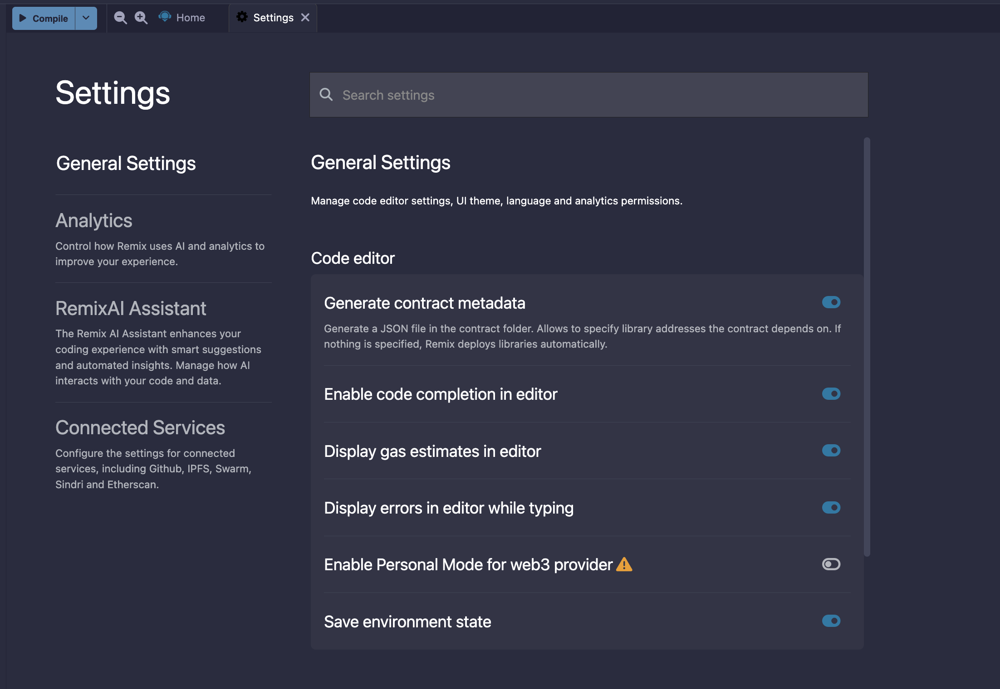
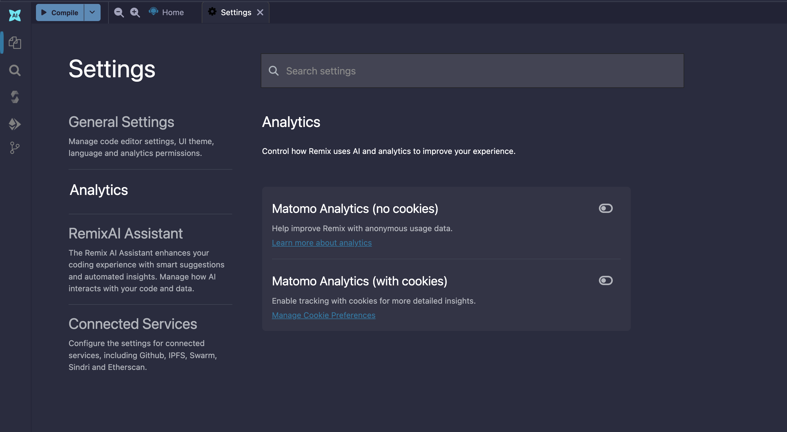
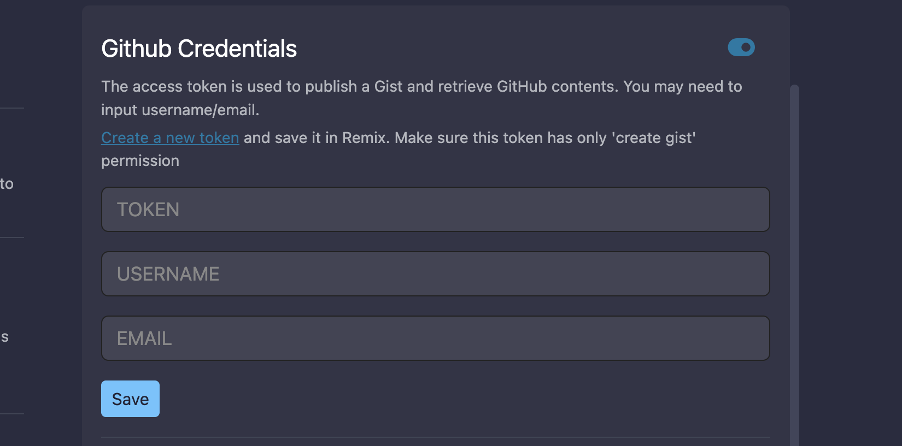
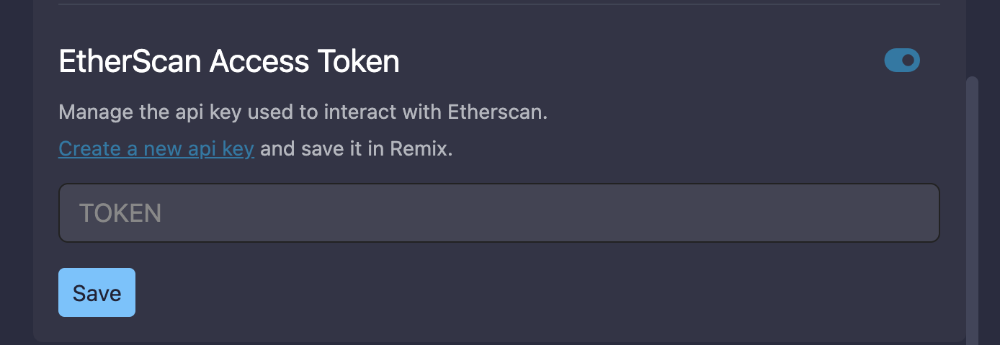
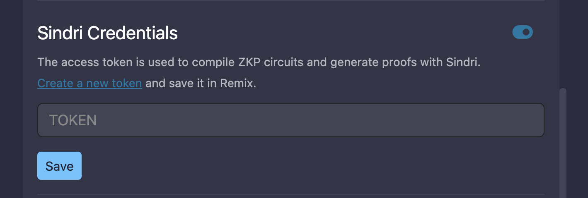
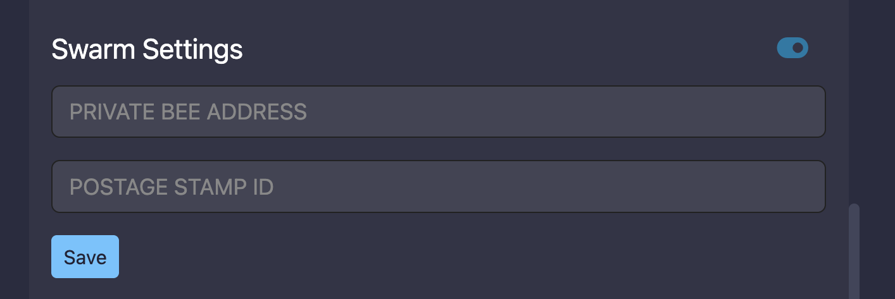
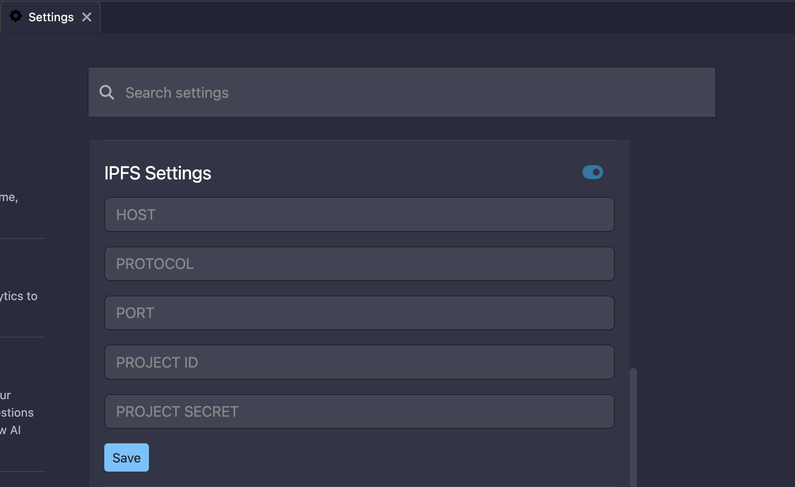

# Settings

You can access **Settings** for Remix by clicking the gear icon on the left side of the Top Bar.

## General Settings

- **Generate contract metadata** is used for deploying with libraries. See our blog post on the subject: [Deploying with Libraries](https://medium.com/remix-ide/deploying-with-libraries-on-remix-ide-24f5f7423b60?sk=68f9c2bf318e85e129e46fe44683a730)
- **Always use Remix VM at Load** will make the Remix VM the selected **environment** when Remix loads.
- **Word wrap** controls if word wrap is enabled in the Editor.
- **Enable code completion in editor** controls code completion. Autocompleting Solidity code happens when you type in the Editor. This option has the Compiler run in the background. For more information about autocomplete, see the {ref}`Editor docs <solidity_editor:autocomplete>`.
- **Display gas estimates in editor** controls if gas estimates are shown. The gas estimates only works when a compilation is successful.
- **Display errors in editor while typing**
- **Enable Personal Mode for web3 provider** can be used when one is connecting to a **local node**. It is used to have Remix temporarily save the passphrase - so that you don't need to **unlock** the account in Geth. Remix will not persist the passphrase - so if you refresh your browser the passphrase will be gone.
- **Save environment state** controls if state of the Remix VM (Remix's simulated blockchain) is saved in a file in the File Explorer. With this option enabled, the Remix VM's state will be saved, so if the browser is closed, the state of the VM will be preserved when you return. This is true as long as the storage in your browser does not get cleared or corrupted.

### Themes

The general settings section has a subsection where you change your themes. For themes Remix only supports the dark and light theme.

## Analytics

**Matomo Analytics** is our "opt-in" analytics platform. The option to turn on Matomo is offered when you first come to Remix. You can disable or enable Matomo here in the Settings panel. We do not collect any personally identifiable information (PII) and our reports are public. See our [blog post on the subject](https://medium.com/remix-ide/help-us-improve-remix-ide-66ef69e14931?source=friends_link&sk=cf9c62fbe1270543eb4bd912e567e2d6).

## RemixAI Assistant

These settings are primarily for the code completion functions of Remix's AI tool, Solidity Copilot. See this {doc}`doc page </ai>` for more information about AI in Remix.

## Connected Accounts

### Github credentials

When performing Git operations on Github and when creating GISTs, it may be necessary to input an access token. This token has the specific permissions for your Git commands. Depending on the operation, you may also need to input your Github username & email address. Remix does not save your password info outside of your browser's localstorage.

### Etherscan Access Token

When debugging verified contracts with the Remix Debugger, it is necessary to input your Etherscan access token in the Settings panel. Whereas, when verifying a contract with the Contract Verification - Etherscan plugin, the API key is input there and not in the Settings panel.

Visit the [Etherscan API page](https://etherscan.io/myapikey) to get your Etherscan API key.

### Sindri Credentials

The access token is used to compile ZKP circuits and generate proofs with Sindri. To generate the token go to [Sindri](https://sindri.app).

### Swarm Settings

In the Solidity Compiler, after the compilation is completed, there is a button to publish to Swarm.

Without putting in an address & postage stamp, you'll be using the public gateway, which may not persist your content as surely as if you put in your own info.

### IPFS Settings

Just like the Swarm settings above, IPFS settings are for publishing your contracts to IPFS from the Solidity Compiler.

- If you do not put in any settings here, you will be using the public Infura node. This will not guarantee your data will persist.

Other options are to:

- Use your own Infura IPFS node. This requires a subscription. [Learn more](https://infura.io/product/ipfs).
- Use any external IPFS which doesn’t require any authentication.
- Use your own local IPFS node (which usually runs under http://localhost:5001)

